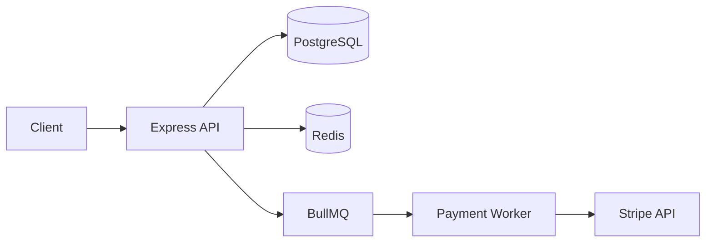

# Usage Examples

## Full Documentation

```
Document this project for Confluence
Generate docs for this repo
Write architecture docs, API reference, and user guide for this codebase
```

Triggers the full pipeline: inventory scan → framework detection → API extraction → strategic reading → three documents → validation.

## Single Document

```
Just generate the architecture overview for this project
I need an API reference for this codebase
Write a user guide for this application
```

The skill will only generate the requested document(s) instead of all three.

## Specific Framework

```
Document this Express API for Confluence
Generate docs for this FastAPI project
Write architecture docs for this Laravel app
```

The skill will use the specified framework's patterns directly, skipping auto-detection.

## With OpenAPI Spec

```
Generate Confluence docs — we have an openapi.yaml
```

The skill will parse the OpenAPI spec directly instead of regex-scanning for endpoints, producing more accurate API documentation.

## Monorepo

```
Document this monorepo — it has 3 services
```

The skill will detect multiple frameworks and ask whether to generate one set of docs for the whole repo or separate docs per service.

## Example Output

### architecture-overview.md (excerpt)
```markdown
# Payment Service — Architecture Overview

## Summary
Payment Service processes credit card transactions, handles refunds, and
manages merchant settlements. Used by the checkout frontend and the
admin dashboard.

## Tech Stack
| Layer | Technology | Version |
|-------|-----------|---------|
| Backend | Node.js / Express | 20.x |
| Database | PostgreSQL | 16 |
| Cache | Redis | 7 |
| Queue | BullMQ (Redis) | — |
| Infrastructure | Docker / AWS ECS | — |

## System Architecture

```

### api-reference.md (excerpt)
```markdown
# Payment Service — API Reference

## Authentication
All API requests require a Bearer token in the Authorization header.
Tokens are issued by the Auth Service and expire after 1 hour.

### POST /api/v1/payments

**Description:** Create a new payment charge

**Auth required:** Yes (Bearer token)

**Parameters:**
| Name | In | Type | Required | Description |
|------|----|------|----------|-------------|
| amount | body | number | yes | Amount in cents |
| currency | body | string | yes | ISO 4217 currency code |
| source | body | string | yes | Payment method ID from Stripe |

**Response:** 201
```json
{
  "id": "pay_123",
  "status": "succeeded",
  "amount": 2000,
  "currency": "usd"
}
```
```

### user-guide.md (excerpt)
```markdown
# Payment Service — User Guide

## What this application does
Payment Service processes credit card payments for the e-commerce platform.
It handles charging customers, issuing refunds, and reconciling settlements
with merchants.
```
